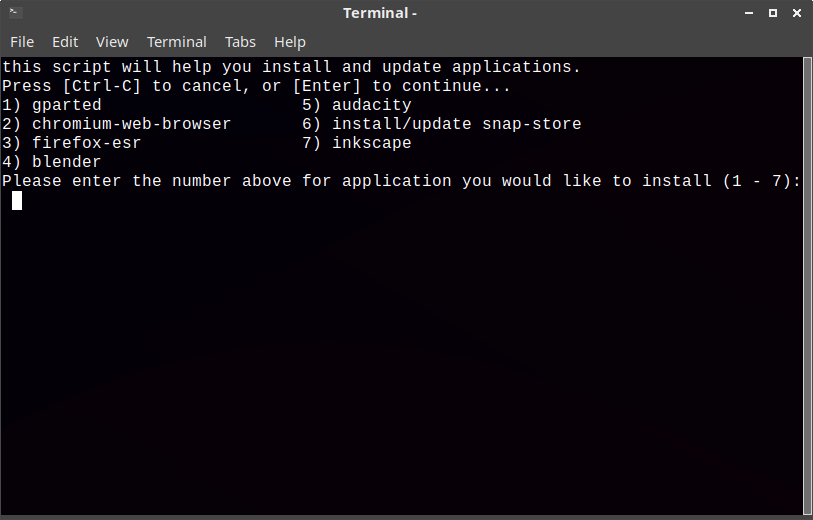

# system-tools
system-tools is a simple terminal app that makes updating the system, installing apps and more, easier and faster, especially if you forget the commands.

## links

* [My blog](https://thepisite.blogspot.com/)
* [YouTube](https://youtube.com/channel/UCM4Fo6ncNybS1xhJHnWSODg)

## Screenshots

## Installation and updates
===========================
to install system-tools, just type the following into terminal:
git clone https://github.com/Itai-Nelken/system-tools.git && cd system-tools && sudo chmod +x install.sh && ./install.sh
to update, type: git pull

## CHANGELOG (dd/mm/yy)
===========================
 * 20/10/2020 - shortened time about and credits are shown by 1 second, improvements to installation scripts, install script now creates menu shortcut
  
  
## To do:
=========
- [ ] return to main menu instead of exiting when executed command finishes
  
