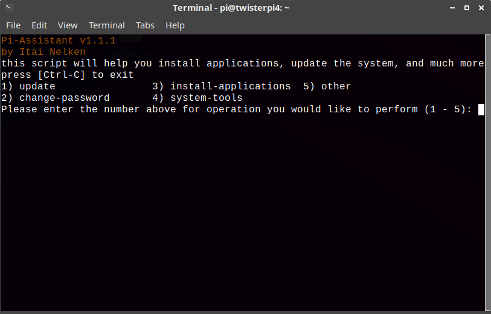
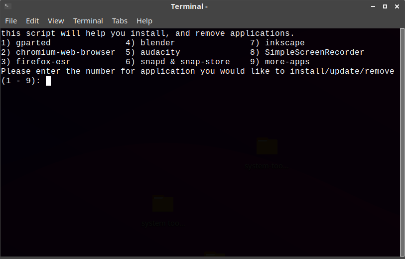
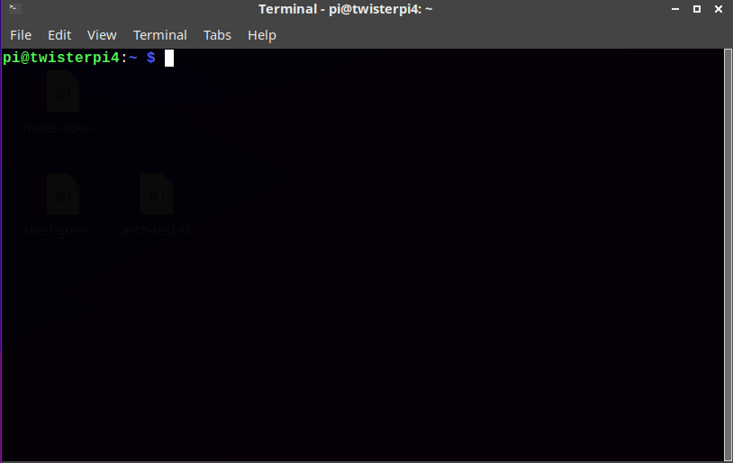

# Pi-Assistant

Pi-Assistant is a simple terminal app that makes updating the system, installing apps and more, easier and faster, especially if you are new to the Linux command line or you forget the commands.

## links

* [My blog](https://thepisite.blogspot.com/)
* [My Raspberry Pi YouTube channel](https://youtube.com/channel/UCaKFjYULBDdkfEcx6oy9Gow)
* [My other YouTube channel](https://youtube.com/channel/UCM4Fo6ncNybS1xhJHnWSODg)

## Installation 

to install Pi-Assistant, just type the following into terminal:
```
$ wget -qO- https://raw.githubusercontent.com/Itai-Nelken/Pi-Assistant/main/install.sh | bash
```
## Run Pi-Assistant

To run Pi-Assistant, use the menu or Desktop shortcuts. alternatively you can type in terminal (from anywhere) `piassist`

## Updates

To update, start Pi-Assistant and go to `other>update-this-tool`

## removal
Pi-Assistant v1.1.1 and later has a removal script in `other>remove` if you have an earlier version or need to manually remove, open terminal and type: 
```sh-session
$ rm -rf ~/Pi-Assistant && sudo rm -f ~/Desktop/system-tools.desktop && sudo rm /usr/local/bin/piassist && sudo rm -f /usr/share/applications/system-tools.desktop 
```

## Screenshots






## CHANGELOG (dd/mm/yy)

 * 20/10/2020 - shortened time about and credits are shown by 1 second, improvements to installation scripts, install script now creates menu shortcut
 * 20/10/2020 - BIG UPDATE: v1.1: added more apps, changed autoremove with apt tools (containing autoremove and autoclean), when commands finish running the script returns to the main menu and more
 * 21/10/2020 - added updater script that runs on startup (disabled because it doesn't work) , version 1.1.1 released, added uninstall script, now you can update manually from system-tools. fixed countless bugs.
 * 26/10/2020 - fixed updater (might not work), bug fixes and improvements. 
 * 1/11/2020 - renamed system-tools to Pi-Assistant, more bug fixes. 
 * 13/11/2020 - UPDATE: v1.1.2: fixed bug where the change-password.sh script wasn't executable, more bug fixes, added more apps
 * 13/11/2020 - UPDATE: v1.1.3: add Balena Etcher app
 * 14/11/2020 - rename 'apt-tools' to 'system-tools', add 'clear swap' option to 'system-tools'
 * 15/11/2020 - UPDATE: v1.1.4: added Zoom with box86
 * 16/11/2020 - added box86 app, fixed bug with install2.sh
 * 25/11/2020 - UPDATE: v1.1.5: bug fixes, updated box86 installer.
  
## Known issues and bugs
* if you installed when the name was system-tools, then after updating to the version after the rename the icons won't change. 
* zoom menu icon doesn't work for some reason.

### Fixed temporarily
- zoom installer is broken because it can't download zoom for some reason

 
## To do:

- [x] return to main menu instead of exiting when executed command finishes
- [x] add uninstall script
- [x] add updater script 
- [ ] make updater script to run on startup
- [x] add zoom & box86
- [x] add box86 as standalone app 
- [x] add etcher (newest version, the one with 'Flash from URL' and 'clone drive'). (added as of v1.1.3, installs 32 or 64 bit             version depending on your system architecture)
- [ ] add USBImager
- [ ] add speedtest-cli
- [ ] add browsh
- [ ] add box86 install script for 64bit OS's


## FAQ

### why is the main script called system-tools-v.1.1.1.sh?
* because before I split the script, I changed the name every release. but now changing the name would mean finding all the places where the name appears and changing it, I might do it in the future. 

