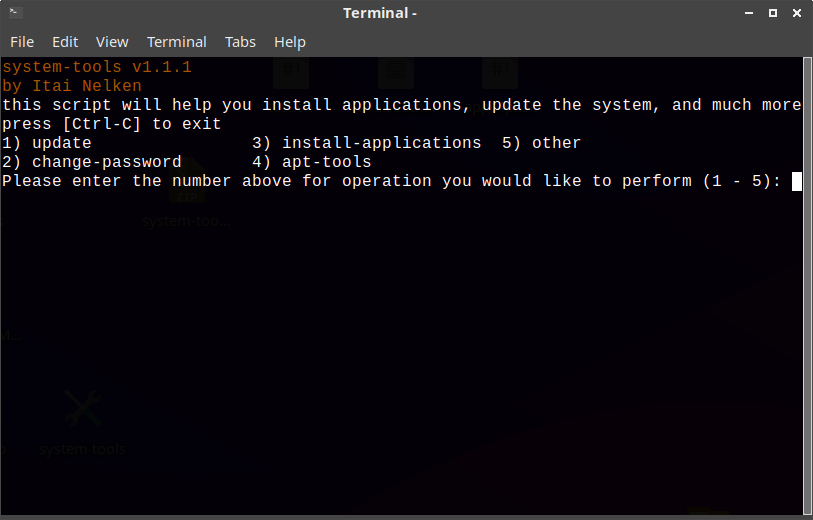

# system-tools (soon to be renamed)

system-tools is a simple terminal app that makes updating the system, installing apps and more, easier and faster, especially if you are new to the Linux command line or you forget the commands.

## links

* [My blog](https://thepisite.blogspot.com/)
* [YouTube](https://youtube.com/channel/UCM4Fo6ncNybS1xhJHnWSODg)

## Installation 

to install system-tools, just type the following into terminal:
```sh-session
$ git clone https://github.com/Itai-Nelken/system-tools.git && cd system-tools && sudo chmod +x install.sh && ./install.sh
```

## removal
system-tools v1.1.1 and later has a removal script in 'other>remove' if you have an earlier version, open terminal and type: 
```sh-session
$ rm -rf ~/system-tools && sudo rm -f ~/Desktop/system-tools.desktop && sudo rm -f /usr/share/applications/system-tools.desktop 
```

## Screenshots




## CHANGELOG (dd/mm/yy)

 * 20/10/2020 - shortened time about and credits are shown by 1 second, improvements to installation scripts, install script now creates menu shortcut
 * 20/10/2020 - BIG UPDATE: v1.1: added more apps, changed autoremove with apt tools (containing autoremove and autoclean), when commands finish running the script returns to the main menu and more
 * 21/10/2020 - added updater script that runs on startup, version 1.1.1 released, added uninstall script, now you can update manually from system-tools. fixed countless bugs. 
  
## Known issues and bugs
*no updater and updates don't work, you have to reinstall to get the new version
  
## To do:

- [x] return to main menu instead of exiting when executed command finishes
- [x] add uninstall script
- [ ] add update script and make it run on startup
- [ ] add zoom & box86
