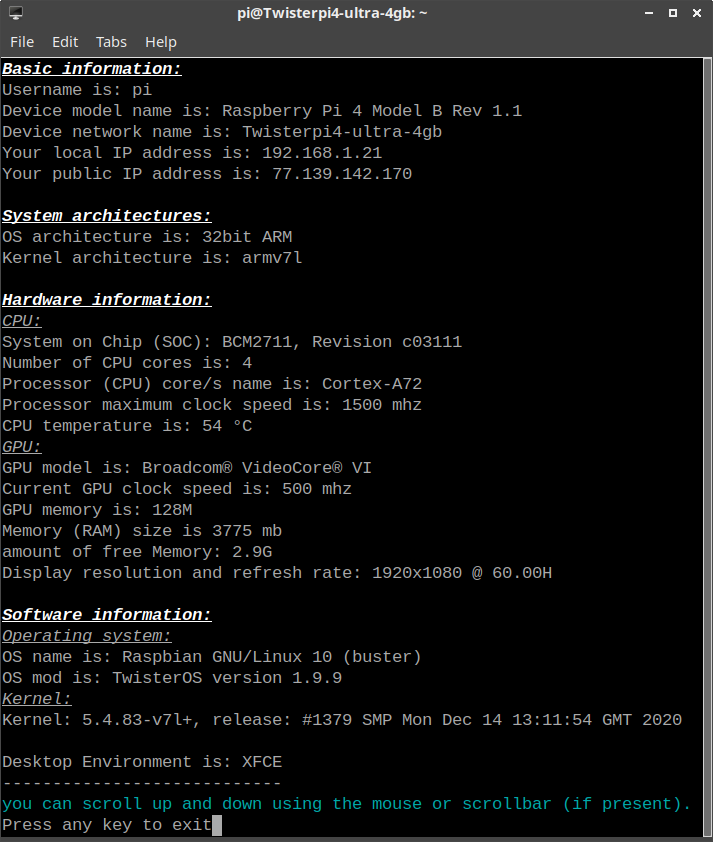

# Pi-Assistant screenshots
### The main menu

### The app installer menu

### Pi-Assistant demo

### The system information option

# [Back to Readme](https://github.com/Itai-Nelken/Pi-Assistant#screenshots)
